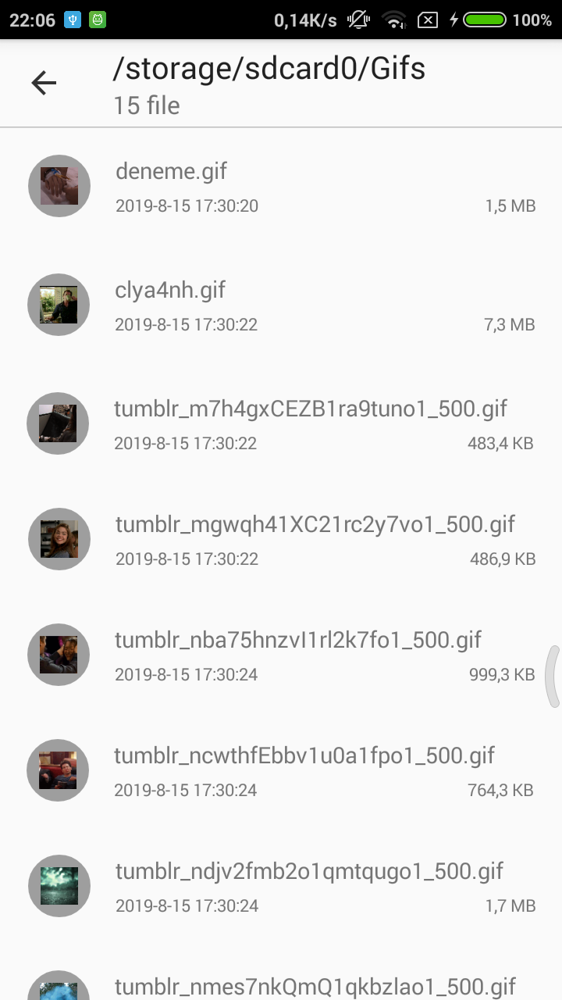

# Gallery View
### GalleryView is a simple gallery library. With customized design, you can select image, video and gif file without needing "intent".

[](https://jitpack.io/#iamkurtgoz/GalleryView)




## Setup
### Step 1. Add the JitPack repository to your build file
Add it in your root build.gradle at the end of repositories:
```
allprojects {
    repositories {
        ...
        maven { url 'https://jitpack.io' }
    }
}
```
### Step 2. Add the dependency
```
dependencies {
    implementation 'com.github.iamkurtgoz:GalleryView:1.0.3'
}
```
### Step 3. Add read permission
```
<uses-permission android:name="android.permission.READ_EXTERNAL_STORAGE"/>
```
### Step 4. Add GalleryActivity into your AndroidManifest.xml 
```
<activity android:name="com.iamkurtgoz.galleryview.GalleryActivity"
    android:screenOrientation="portrait"
    android:theme="@style/Theme.AppCompat.Light.NoActionBar"/>
```
### Step 5. The GalleryView configuration is created using the builder pattern.
```
GalleryActivity.start(context, GalleryMediaType.ALL_MEDIA); //Lists all files.
GalleryActivity.start(context, GalleryMediaType.IMAGE_VIDEO); //Lists pictures and videos only. Gifs included.
GalleryActivity.start(context, GalleryMediaType.ONLY_IMAGE); //List only image files.
GalleryActivity.start(context, GalleryMediaType.ONLY_VIDEO); //List only video files.
```

### Step 6. Override onActivityResult method and handle GalleryView result.
```
@Override
protected void onActivityResult(int requestCode, int resultCode, @Nullable Intent data) {
    super.onActivityResult(requestCode, resultCode, data);
    if (requestCode == GalleryActivity.GALLERY_REQUEST_CODE) {
        if (resultCode == GalleryActivity.GALLERY_RESULT_PERMISSION_CANCEL){
            Toast.makeText(this, "Cancelled.", Toast.LENGTH_SHORT).show();
        } else if (resultCode == GalleryActivity.GALLERY_RESULT_PERMISSION_ERROR){
            Toast.makeText(this, "Permission Error.", Toast.LENGTH_SHORT).show();
        } else if (resultCode == GalleryActivity.GALLERY_RESULT_SUCCESS){
            String path = data.getStringExtra(GalleryActivity.FILE_PATH);
            Toast.makeText(this, path, Toast.LENGTH_SHORT).show();
        }
    }
}
```
### Contact : iamkurtgoz@gmail.com
